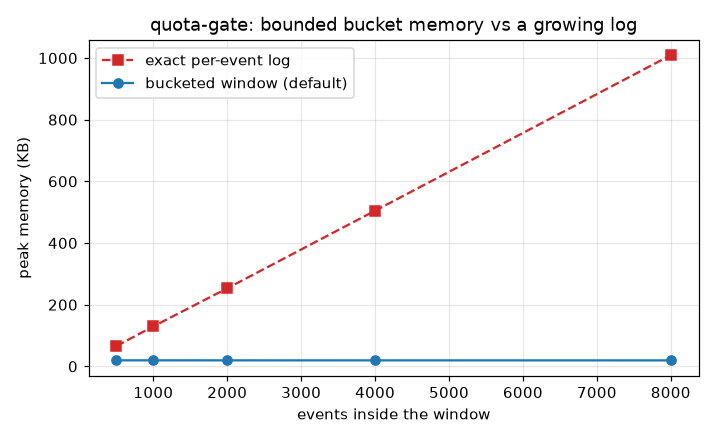
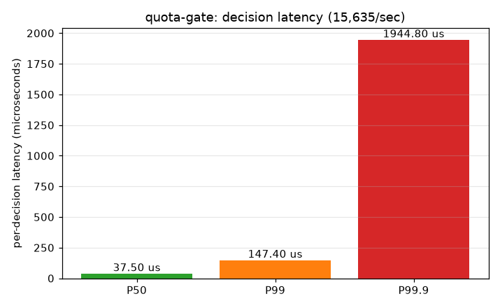

# Benchmarks

Produced by `bench/benchmark.py` (needs `matplotlib`; the library and its tests have
no third-party dependencies):

```
python bench/benchmark.py
```

It writes the two graphs below and `bench/results/summary.json`. These measure the
Python reference implementation; the C# and Java ports share the same algorithm and
are faster, but the *shape* - flat memory, stable latency - is identical.

Absolute timing numbers depend on the machine. The memory numbers are architectural
and reproduce anywhere.

## Bounded memory: the whole reason for the bucketed window



Peak memory as the number of events inside the window grows:

| Events in window | Bucketed window (default) | Exact per-event log |
|:----------------:|:-------------------------:|:-------------------:|
| 500 | 19.5 KB | 65.9 KB |
| 1,000 | 19.5 KB | 129.6 KB |
| 2,000 | 19.4 KB | 253.2 KB |
| 4,000 | 19.4 KB | 504.8 KB |
| 8,000 | 19.3 KB | 1,009.0 KB |

This is the graph that justifies the default. The bucketed window stays **flat at
~19.5 KB** no matter how much traffic passes through it, because it only ever holds
a fixed number of counters. The exact log grows **linearly**, hitting ~1 MB at 8k
in-window events - and a real daily cap under load holds far more than 8k. On a busy
service the log approach is what eventually pages you at 3am; the bucket approach
simply doesn't. The stress suite proves the accuracy cost of this is bounded to one
bucket's granularity.

## Decision latency on the hot path



A realistic model carrying three rules at once (per-minute TPM+RPM, a daily cap, and
a spend cap), so every call evaluates several windows:

| Metric | Value (pure Python) |
|--------|---------------------|
| Throughput | ~16,000 decisions/sec |
| P50 | ~37 us |
| P99 | ~147 us |
| P99.9 | ~1.9 ms |

Throughput is measured in a clean loop; the percentiles come from a separately
sampled loop with per-call timing overhead, so treat the tail as conservative. The
P99.9 spikes are periodic bucket eviction and dictionary growth - amortized cheap,
occasionally visible, which is why it shows up only in the 99.9th percentile. For a
limiter that guards network calls taking tens to hundreds of milliseconds, a
sub-200-us P99 decision is comfortably in the noise. The compiled ports remove most
of the constant factor.

## Reading these together

The memory graph is the load-bearing result: it's an architectural guarantee, not a
tuning artifact, and it's the difference between a limiter that scales with your
traffic and one whose memory does. The latency numbers say the hot path is cheap
enough to sit in front of every call without anyone noticing.
